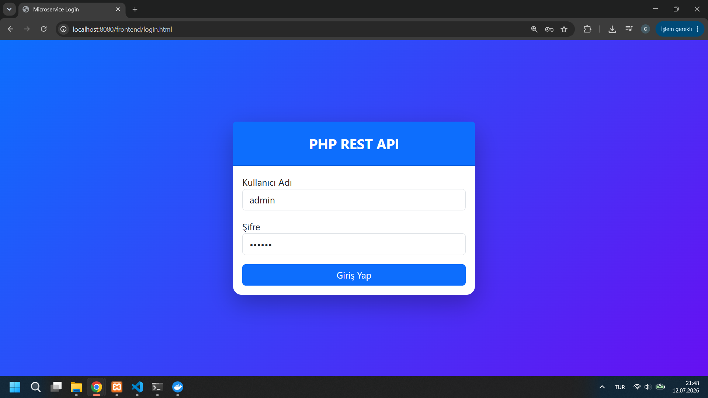
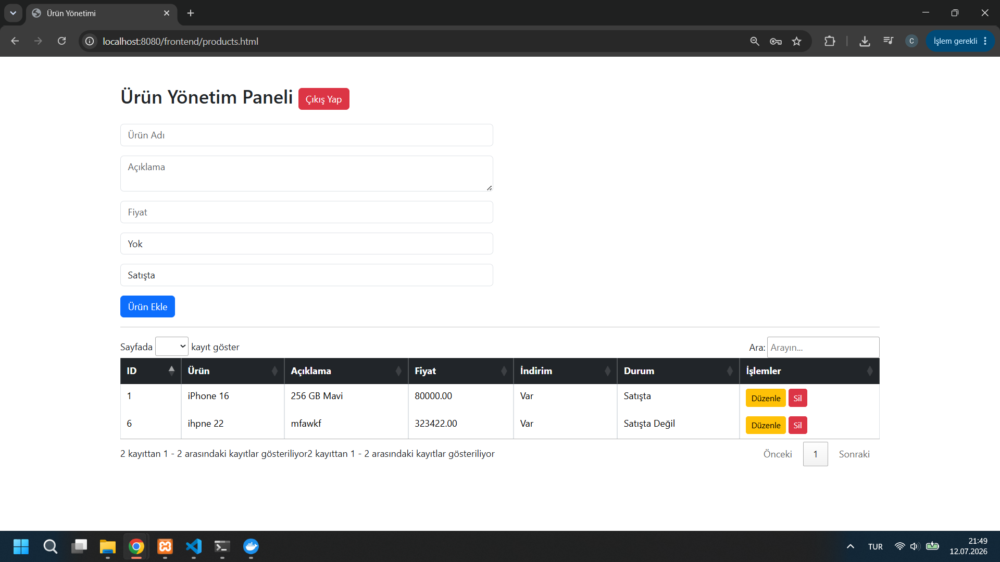
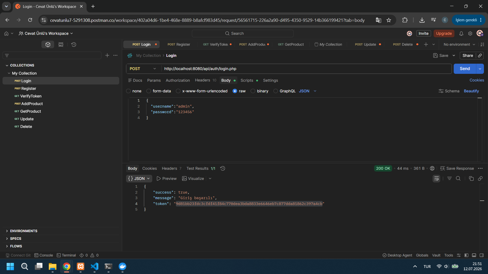
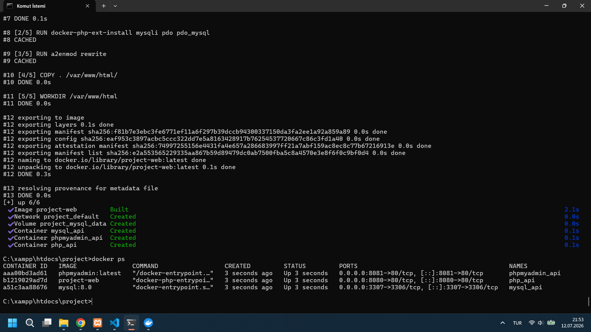

# PHP REST API Microservice

## Proje Hakkında

Bu proje PHP kullanılarak Restful API mimarisinde geliştirilmiş bir mikroservistir.

## Özellikler

- Login
- Register
- Token Authentication
- Token Verification
- Ürün Ekleme
- Ürün Listeleme
- Ürün Güncelleme
- Ürün Silme
- Pagination
- Logger
- Docker
- AJAX
- Bootstrap
- DataTables
- Toastr

## Kullanılan Teknolojiler

- PHP 8.2
- MySQL 8
- Apache
- Docker
- Bootstrap 5
- jQuery
- AJAX
- DataTables
- Toastr

## Kurulum

```bash
docker compose up --build -d
```

## Frontend

```
http://localhost:8080/frontend/login.html
```

## Test Kullanıcısı

```
Kullanıcı Adı : admin
Şifre : 123456
```

## API

### Auth

POST

```
/api/auth/login.php
```

POST

```
/api/auth/register.php
```

GET

```
/api/auth/verifyToken.php
```

### Products

POST

```
/api/products/addProduct.php
```

GET

```
/api/products/getProducts.php
```

POST

```
/api/products/updateProduct.php
```

POST

```
/api/products/deleteProduct.php
```
#Login



#Products



#Postman



#Docker

